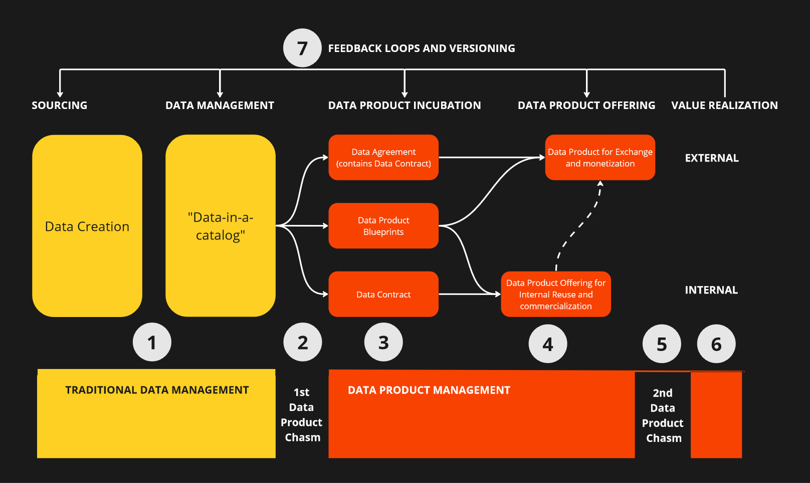

# Terraforming Data Product Governance

Terraforming the Data Product Governance is a revolutionary concept that integrates Data Products, Data Contracts, Data Agreements, Pricing Plans as Code, Data Quality as Code, and SLA as Code into a cohesive, programmable, and scalable framework. This approach transforms data product management into an advanced, automated process, akin to terraforming, utilizing reusable blueprints described in a machine-readable format.

By leveraging system configurations and pure code, the Data Product Governance framework empowers organizations to manage and optimize their data assets efficiently, ensuring seamless interoperability, high data quality, and robust compliance with contractual and service-level agreements. This innovative paradigm shifts the data management landscape, fostering greater agility, precision, and control in the ever-evolving data economy.

# Further information - Get the book

A book has been written about the Terraforming the Data Product Governance and it is available as hardcover and PDF. The book explains the model in details and repositories under this organization offers more practical extension to it. The most value can be gained by purchasing the book and then apply models described here. 

* PDF version available on Leanpub, https://leanpub.com/terraformingdataproduct 
* Hardcover version from Amazon,  

If you need help in adopting the models, do not hesitate to contact: https://www.linkedin.com/in/jarkkomoilanen/ 

# Main concepts

Below you can find descriptions of the main concepts of the model. 

## Data Product Blueprint model

## Interoperability Framework

